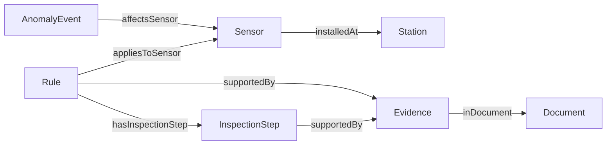

# iMAKS 설비 이상 점검 지원 Ontology v1

작성일: 2026-10-05. 팀 회의용 제안이며 확정된 표준이 아니다. 기계 판독본은 `ontology.ttl`, 검증 규칙은 `shapes.ttl`이다.

## 1. 범위와 질문

제조 4개 스테이션을 중심으로 설계하되, 입력 정적 그래프는 전체 9개 스테이션·22개 센서를 보존한다. 인물·출입·CSI·SafetyEvent는 이번 범위에서 제외한다.

|질문|필요한 경로|이번 검증|
|---|---|---|
|CQ1. 이상 센서는 어느 스테이션에 속하는가?|Sensor → installedAt → Station|실제 메타데이터 및 예제 SPARQL|
|CQ2. 이상이 어느 센서에서 언제 발생했는가?|AnomalyEvent → affectsSensor → Sensor; startTime/endTime|DEMO 이벤트 조회|
|CQ3. 관련 점검 단계와 문서 출처는 무엇인가?|Rule → appliesToSensor / hasInspectionStep → supportedBy → Evidence → inDocument|SOP-003 MAINT-02 수동 예제 조회|

CQ3는 단지 센서에 연결된 점검 후보를 찾는다. 해당 이벤트가 규칙의 수치·기간 조건을 만족한다는 의미가 아니다. 예제 이벤트는 10분, 규칙 조건은 30분 이상이므로 조건 충족을 주장하지 않는다.

## 2. 클래스

|클래스|의미|근거·생성 방법|
|---|---|---|
|Station|생산 공정 또는 보조 구역의 설비 단위|시계열 station_id; 기존 KG Component.name 참고|
|Sensor|하나의 측정 센서|sensor_id, sensor_type, unit을 CSV ETL|
|AnomalyEvent|탐지기가 보고한 시간 구간|추후 탐지 결과로 생성; 정답 노드 복사 금지|
|Document|SOP 또는 데이터시트|원본 파일명·문서 ID|
|Evidence|문서의 페이지·절·근거 텍스트|PDF 추출 후 검토|
|Rule|조건과 적용 대상을 갖는 규칙 후보|추후 LLM 추출 및 검증; 현재 수동 예제 1건|
|InspectionStep|문서가 제안하는 점검 행동|Rule에 연결; 실제 수행 이력이나 확정 원인이 아님|

## 3. 관계

|관계|출발 → 도착|설계 이유|
|---|---|---|
|installedAt|Sensor → Station|센서 소속; 현재 데이터에서는 정확히 하나|
|feedsInto|Station → Station|공정 흐름; 고장 인과관계와 구분|
|affectsSensor|AnomalyEvent → Sensor|하나 이상 허용; 복수 센서 이벤트 표현 가능|
|appliesToSensor|Rule → Sensor|점검 후보 검색 범위|
|hasInspectionStep|Rule → InspectionStep|조건과 점검 행동을 분리|
|supportedBy|Rule 또는 InspectionStep → Evidence|주장의 문서 근거 추적|
|inDocument|Evidence → Document|파일·문서 출처로 이동|

## 4. 속성과 식별자

|대상|속성|자료형/정책|
|---|---|---|
|Sensor|sensorId, unit|string; 원본 ID·단위 유지|
|Station|stationId|string; Component 전체를 일반 설비로 확대 해석하지 않음|
|AnomalyEvent|startTime, endTime|xsd:dateTime; 시간대 없는 원본 유지. 종료 시각 선택적|
|AnomalyEvent|anomalyType|string; 추후 예측값, 미분류 허용. 정답을 채우지 않음|
|Document|sourceFile|string; raw 기준 상대 경로|
|Evidence|page, section, text|1-based integer, string, string|
|Rule|condition, reviewStatus|string; 추출 후보와 검토 결과 구분|
|InspectionStep|text|string; 문서에 근거한 행동|

네임스페이스 `https://example.org/imaks/`는 프로젝트 로컬 예시 IRI이며 웹 서비스가 아니다. 정적 객체는 원본 이름을 사용하고, 예제 이벤트는 `DEMO_`, 향후 탐지 이벤트는 별도 `DET_` 접두사를 권장한다. GT ID는 평가 디렉터리에만 둔다.

## 5. SHACL v1: 다섯 제약 묶음

1. 센서 ID: 비어 있지 않은 문자열 정확히 하나.
2. 센서 소속: 명시적으로 Station인 IRI 하나.
3. 이벤트 시간: 시작 시각 필수, 종료 시각 선택, 각각 dateTime 하나.
4. 이벤트 대상: 명시적으로 Sensor인 IRI 최소 하나. 대상 센서 자체도 센서 제약 검증.
5. 시간 순서: 종료 시각이 있을 때 시작보다 빠르지 않음.

`validate_graph.py`는 정상·종료 전 이벤트·실제 정적 KG의 통과, 누락·미등록 센서·역전 시간의 실패를 검증한다. 잘못된 예제가 실패해야 테스트가 성공한 것이다. 센서 ID의 그래프 전체 유일성은 현재 CSV 점검이 담당한다. 출처 완전성·규칙 수치 조건·허용 이상 유형 등은 후속 Shapes 확장 대상이며 현재 검증했다고 주장하지 않는다.

RDFS domain/range는 추론 선언이고 필수값 검증이 아니다. 검증은 `inference='none'`으로 실행해서 없는 타입이 자동 추론되어 통과하지 않게 했다. SHACL의 구조 통과는 규칙 의미나 실제 고장 원인이 맞다는 보증이 아니다.

## 6. 기존 KG와의 차이 / 기여 범위

- 참고: Sensor, Component, feeds_into와 원본 식별자.
- 재설계: Component를 이번 범위에서 Station으로 매핑; 문서 출처를 Evidence로 별도 표현.
- 제외: 정답 이상·안전 이벤트, Maintenance 정답, 인물·출입 권한, 이벤트 관련 관계·속성.
- 추가: 탐지 이벤트 인터페이스, 점검 단계·출처 모델, 실행 가능한 SHACL.
- 아직 하지 않은 것: LLM 전체 문서 추출, 실시간 탐지 이벤트 주입, GraphRAG 검색 성능 실험. 현재 예제는 수동으로 만든 구조 검증용이다.

## 7. 회의에서 결정할 것

1. 전체 9개 스테이션 14개 이벤트를 유지할지, 제조 4개 스테이션 9개 이벤트로 좁힐지.
2. 규칙을 센서에 직접 연결할지, 측정 유형·스테이션 대상 규칙도 함께 모델링할지.
3. SOP와 데이터시트의 상충 수치를 출처별 Rule로 보존하는 확장안. 하나의 센서 속성으로 덮어쓰지 않기.

참고: [iMAKS 원본](https://zenodo.org/records/20075430), [W3C SHACL](https://www.w3.org/TR/shacl/).
